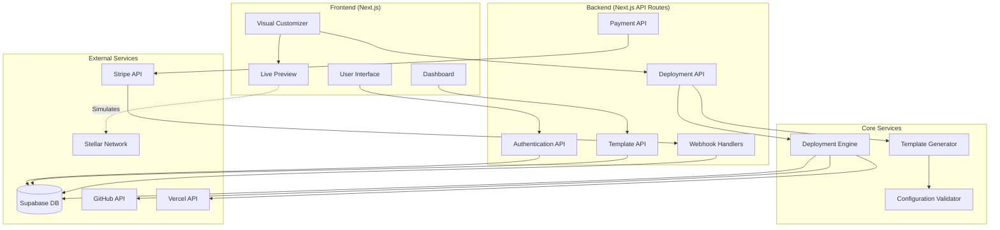
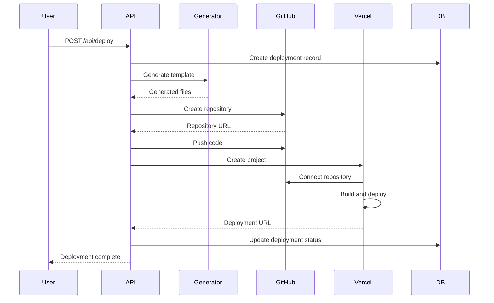

# Design Document: CRAFT Platform

## Overview

CRAFT is a no-code platform that enables users to deploy customized DeFi applications on the Stellar blockchain. The platform architecture follows a modern full-stack approach using Next.js for both frontend and backend, Supabase for authentication and data persistence, and automated deployments pipelines through GitHub and Vercel APIs.

The system is designed with three core pillars:

1. **User Experience Layer**: A visual interface for template selection, customization, and deployment management
2. **Generation and Orchestration Layer**: Code generation and deployment automation engines
3. **Integration Layer**: External service integrations (Supabase, GitHub, Vercel, Stripe, Stellar)

The architecture maintains blockchain abstraction to support future multi-chain expansion while initially focusing on Stellar-specific implementations.

## Architecture

### System Architecture Diagram



### Technology Stack

**Frontend:**
- Next.js 14 (App Router)
- React 18
- TailwindCSS for styling
- Shadcn/ui component library
- React Query for data fetching
- Zustand for state management

**Backend:**
- Next.js API Routes
- Supabase Client for database operations
- Zod for validation

**Database:**
- Supabase (PostgreSQL)
- Row-Level Security (RLS) policies

**External Integrations:**
- GitHub REST API (repository management)
- Vercel API (deployment automation)
- Stripe API (payment processing)
- Stellar SDK (blockchain interaction)

**Monorepo Structure (Turborepo):**
```
craft-platform/
├── apps/
│   ├── web/                 # Main Next.js application
│   └── generator/           # Template generation service
├── packages/
│   ├── types/              # Shared TypeScript types
│   ├── ui/                 # Shared UI components
│   ├── stellar/            # Stellar SDK wrapper
│   └── config/             # Shared configuration
└── templates/
    ├── stellar-dex/
    ├── soroban-defi/
    ├── payment-gateway/
    └── asset-issuance/
```

## Components and Interfaces

### 1. Authentication System

**Component: AuthService**

Handles user authentication and session management using Supabase Auth.

```typescript
interface AuthService {
  signUp(email: string, password: string): Promise<AuthResult>
  signIn(email: string, password: string): Promise<AuthResult>
  signOut(): Promise<void>
  getCurrentUser(): Promise<User | null>
  updateProfile(userId: string, updates: ProfileUpdate): Promise<User>
}

interface AuthResult {
  user: User | null
  session: Session | null
  error: AuthError | null
}

interface User {
  id: string
  email: string
  createdAt: Date
  subscriptionTier: SubscriptionTier
  githubConnected: boolean
}

type SubscriptionTier = 'free' | 'pro' | 'enterprise'
```

### 2. Template Management System

**Component: TemplateService**

Manages template discovery, metadata, and base template storage.

```typescript
interface TemplateService {
  listTemplates(filters?: TemplateFilters): Promise<Template[]>
  getTemplate(templateId: string): Promise<Template>
  getTemplateMetadata(templateId: string): Promise<TemplateMetadata>
}

interface Template {
  id: string
  name: string
  description: string
  category: TemplateCategory
  blockchainType: 'stellar'
  baseRepositoryUrl: string
  previewImageUrl: string
  features: TemplateFeature[]
  customizationSchema: CustomizationSchema
}

type TemplateCategory = 'dex' | 'lending' | 'payment' | 'asset-issuance'

interface TemplateFeature {
  id: string
  name: string
  description: string
  enabled: boolean
  configurable: boolean
}

interface CustomizationSchema {
  branding: BrandingOptions
  features: FeatureToggles
  stellar: StellarConfiguration
}
```

### 3. Customization System

**Component: CustomizationService**

Manages user customizations and preview state.

```typescript
interface CustomizationService {
  saveCustomization(deploymentId: string, config: CustomizationConfig): Promise<void>
  loadCustomization(deploymentId: string): Promise<CustomizationConfig>
  validateCustomization(config: CustomizationConfig): ValidationResult
}

interface CustomizationConfig {
  branding: BrandingConfig
  features: FeatureConfig
  stellar: StellarConfig
}

interface BrandingConfig {
  appName: string
  logoUrl?: string
  primaryColor: string
  secondaryColor: string
  fontFamily: string
}

interface FeatureConfig {
  enableCharts: boolean
  enableTransactionHistory: boolean
  enableAnalytics: boolean
  enableNotifications: boolean
}

interface StellarConfig {
  network: 'mainnet' | 'testnet'
  horizonUrl: string
  sorobanRpcUrl?: string
  assetPairs?: AssetPair[]
  contractAddresses?: Record<string, string>
}

interface AssetPair {
  base: StellarAsset
  counter: StellarAsset
}

interface StellarAsset {
  code: string
  issuer: string
  type: 'native' | 'credit_alphanum4' | 'credit_alphanum12'
}
```

### 4. Template Generator

**Component: TemplateGenerator**

Generates customized code from base templates.

```typescript
interface TemplateGenerator {
  generateTemplate(request: GenerationRequest): Promise<GenerationResult>
  validateGeneration(result: GenerationResult): Promise<ValidationResult>
}

interface GenerationRequest {
  templateId: string
  customization: CustomizationConfig
  outputPath: string
}

interface GenerationResult {
  success: boolean
  generatedFiles: GeneratedFile[]
  errors: GenerationError[]
}

interface GeneratedFile {
  path: string
  content: string
  type: 'code' | 'config' | 'asset'
}

interface GenerationError {
  file: string
  line?: number
  message: string
  severity: 'error' | 'warning'
}
```

**Generation Process:**

1. Clone base template from templates directory
2. Parse customization configuration
3. Apply transformations:
   - Replace branding placeholders in code and config files
   - Toggle feature flags in configuration
   - Generate Stellar network configuration files
   - Update environment variable templates
4. Validate generated code syntax
5. Return generated file tree

### 5. Deployment Engine

**Component: DeploymentEngine**

Orchestrates GitHub repository creation and Vercel deployment.

```typescript
interface DeploymentEngine {
  deploy(request: DeploymentRequest): Promise<DeploymentResult>
  getDeploymentStatus(deploymentId: string): Promise<DeploymentStatus>
  redeployWithUpdates(deploymentId: string, updates: CustomizationConfig): Promise<DeploymentResult>
  deleteDeployment(deploymentId: string): Promise<void>
}

interface DeploymentRequest {
  userId: string
  templateId: string
  customization: CustomizationConfig
  repositoryName: string
}

interface DeploymentResult {
  deploymentId: string
  repositoryUrl: string
  vercelUrl: string
  status: DeploymentStatus
}

type DeploymentStatus = 
  | { stage: 'generating', progress: number }
  | { stage: 'creating_repo', progress: number }
  | { stage: 'pushing_code', progress: number }
  | { stage: 'deploying_vercel', progress: number }
  | { stage: 'completed', url: string }
  | { stage: 'failed', error: string }
```

**Deployment Pipeline:**



### 6. GitHub Integration

**Component: GitHubService**

Manages GitHub API interactions for repository operations.

```typescript
interface GitHubService {
  createRepository(request: CreateRepoRequest): Promise<Repository>
  pushCode(repoUrl: string, files: GeneratedFile[]): Promise<void>
  updateRepository(repoUrl: string, files: GeneratedFile[]): Promise<void>
  validateAccess(userId: string): Promise<boolean>
}

interface CreateRepoRequest {
  name: string
  description: string
  private: boolean
  userId: string
}

interface Repository {
  url: string
  fullName: string
  defaultBranch: string
}
```

**Implementation Notes:**
- Use GitHub App authentication for secure API access
- Store GitHub access tokens encrypted in Supabase
- Handle rate limiting with exponential backoff
- Support both user repositories and organization repositories

### 7. Vercel Integration

**Component: VercelService**

Manages Vercel API interactions for deployment operations.

```typescript
interface VercelService {
  createProject(request: CreateProjectRequest): Promise<VercelProject>
  deployProject(projectId: string): Promise<VercelDeployment>
  getDeploymentLogs(deploymentId: string): Promise<DeploymentLog[]>
  configureDomain(projectId: string, domain: string): Promise<DomainConfig>
  getDeploymentStatus(deploymentId: string): Promise<VercelDeploymentStatus>
}

interface CreateProjectRequest {
  name: string
  gitRepository: GitRepository
  environmentVariables: EnvironmentVariable[]
  framework: 'nextjs'
  buildCommand?: string
  outputDirectory?: string
}

interface GitRepository {
  type: 'github'
  repo: string
}

interface EnvironmentVariable {
  key: string
  value: string
  target: ('production' | 'preview' | 'development')[]
}

interface VercelDeployment {
  id: string
  url: string
  status: 'QUEUED' | 'BUILDING' | 'READY' | 'ERROR'
  createdAt: Date
}

interface DeploymentLog {
  timestamp: Date
  message: string
  level: 'info' | 'warn' | 'error'
}
```

### 8. Payment System

**Component: PaymentService**

Manages Stripe integration for subscriptions.

```typescript
interface PaymentService {
  createCheckoutSession(userId: string, priceId: string): Promise<CheckoutSession>
  handleWebhook(event: StripeEvent): Promise<void>
  cancelSubscription(subscriptionId: string): Promise<void>
  getSubscriptionStatus(userId: string): Promise<SubscriptionStatus>
}

interface CheckoutSession {
  sessionId: string
  url: string
}

interface SubscriptionStatus {
  tier: SubscriptionTier
  status: 'active' | 'canceled' | 'past_due' | 'unpaid'
  currentPeriodEnd: Date
  cancelAtPeriodEnd: boolean
}
```

**Webhook Handling:**
- `checkout.session.completed`: Activate subscription
- `customer.subscription.updated`: Update subscription status
- `customer.subscription.deleted`: Deactivate subscription
- `invoice.payment_failed`: Mark subscription as past due

### 9. Live Preview System

**Component: PreviewService**

Generates real-time previews of customized templates.

```typescript
interface PreviewService {
  generatePreview(customization: CustomizationConfig): Promise<PreviewData>
  updatePreview(previewId: string, changes: Partial<CustomizationConfig>): Promise<PreviewData>
}

interface PreviewData {
  html: string
  css: string
  assets: PreviewAsset[]
  mockData: StellarMockData
}

interface PreviewAsset {
  url: string
  type: 'image' | 'font' | 'icon'
}

interface StellarMockData {
  accountBalance: string
  recentTransactions: MockTransaction[]
  assetPrices: Record<string, number>
}
```

**Preview Implementation:**
- Use iframe sandbox for isolated preview rendering
- Apply customizations to template HTML/CSS in real-time
- Mock Stellar SDK responses for preview interactions
- Update preview via postMessage communication

## Data Models

### Database Schema (Supabase)

```sql
-- Users table (managed by Supabase Auth)
-- Extended with custom profile data

CREATE TABLE profiles (
  id UUID PRIMARY KEY REFERENCES auth.users(id),
  subscription_tier TEXT NOT NULL DEFAULT 'free',
  subscription_status TEXT,
  stripe_customer_id TEXT,
  stripe_subscription_id TEXT,
  github_connected BOOLEAN DEFAULT FALSE,
  github_username TEXT,
  created_at TIMESTAMPTZ DEFAULT NOW(),
  updated_at TIMESTAMPTZ DEFAULT NOW()
);

-- Templates table
CREATE TABLE templates (
  id UUID PRIMARY KEY DEFAULT gen_random_uuid(),
  name TEXT NOT NULL,
  description TEXT,
  category TEXT NOT NULL,
  blockchain_type TEXT NOT NULL DEFAULT 'stellar',
  base_repository_url TEXT NOT NULL,
  preview_image_url TEXT,
  customization_schema JSONB NOT NULL,
  is_active BOOLEAN DEFAULT TRUE,
  created_at TIMESTAMPTZ DEFAULT NOW(),
  updated_at TIMESTAMPTZ DEFAULT NOW()
);

-- Deployments table
CREATE TABLE deployments (
  id UUID PRIMARY KEY DEFAULT gen_random_uuid(),
  user_id UUID NOT NULL REFERENCES profiles(id) ON DELETE CASCADE,
  template_id UUID NOT NULL REFERENCES templates(id),
  name TEXT NOT NULL,
  customization_config JSONB NOT NULL,
  repository_url TEXT,
  vercel_project_id TEXT,
  vercel_deployment_id TEXT,
  deployment_url TEXT,
  custom_domain TEXT,
  status TEXT NOT NULL DEFAULT 'pending',
  error_message TEXT,
  created_at TIMESTAMPTZ DEFAULT NOW(),
  updated_at TIMESTAMPTZ DEFAULT NOW(),
  deployed_at TIMESTAMPTZ
);

-- Deployment logs table
CREATE TABLE deployment_logs (
  id UUID PRIMARY KEY DEFAULT gen_random_uuid(),
  deployment_id UUID NOT NULL REFERENCES deployments(id) ON DELETE CASCADE,
  stage TEXT NOT NULL,
  message TEXT NOT NULL,
  level TEXT NOT NULL DEFAULT 'info',
  metadata JSONB,
  created_at TIMESTAMPTZ DEFAULT NOW()
);

-- Customization drafts table (for save/resume)
CREATE TABLE customization_drafts (
  id UUID PRIMARY KEY DEFAULT gen_random_uuid(),
  user_id UUID NOT NULL REFERENCES profiles(id) ON DELETE CASCADE,
  template_id UUID NOT NULL REFERENCES templates(id),
  customization_config JSONB NOT NULL,
  created_at TIMESTAMPTZ DEFAULT NOW(),
  updated_at TIMESTAMPTZ DEFAULT NOW()
);

-- Analytics table
CREATE TABLE deployment_analytics (
  id UUID PRIMARY KEY DEFAULT gen_random_uuid(),
  deployment_id UUID NOT NULL REFERENCES deployments(id) ON DELETE CASCADE,
  metric_type TEXT NOT NULL,
  metric_value NUMERIC NOT NULL,
  recorded_at TIMESTAMPTZ DEFAULT NOW()
);

-- Row-Level Security Policies
ALTER TABLE profiles ENABLE ROW LEVEL SECURITY;
ALTER TABLE deployments ENABLE ROW LEVEL SECURITY;
ALTER TABLE deployment_logs ENABLE ROW LEVEL SECURITY;
ALTER TABLE customization_drafts ENABLE ROW LEVEL SECURITY;
ALTER TABLE deployment_analytics ENABLE ROW LEVEL SECURITY;

-- Users can only access their own data
CREATE POLICY "Users can view own profile" ON profiles
  FOR SELECT USING (auth.uid() = id);

CREATE POLICY "Users can update own profile" ON profiles
  FOR UPDATE USING (auth.uid() = id);

CREATE POLICY "Users can view own deployments" ON deployments
  FOR SELECT USING (auth.uid() = user_id);

CREATE POLICY "Users can create own deployments" ON deployments
  FOR INSERT WITH CHECK (auth.uid() = user_id);

CREATE POLICY "Users can update own deployments" ON deployments
  FOR UPDATE USING (auth.uid() = user_id);

CREATE POLICY "Users can delete own deployments" ON deployments
  FOR DELETE USING (auth.uid() = user_id);

-- Similar policies for other tables...
```

### Type Definitions

```typescript
// Shared types package
export interface Deployment {
  id: string
  userId: string
  templateId: string
  name: string
  customizationConfig: CustomizationConfig
  repositoryUrl?: string
  vercelProjectId?: string
  vercelDeploymentId?: string
  deploymentUrl?: string
  customDomain?: string
  status: DeploymentStatusType
  errorMessage?: string
  createdAt: Date
  updatedAt: Date
  deployedAt?: Date
}

export type DeploymentStatusType = 
  | 'pending'
  | 'generating'
  | 'creating_repo'
  | 'pushing_code'
  | 'deploying'
  | 'completed'
  | 'failed'

export interface DeploymentLog {
  id: string
  deploymentId: string
  stage: string
  message: string
  level: 'info' | 'warn' | 'error'
  metadata?: Record<string, unknown>
  createdAt: Date
}
```


## Correctness Properties

A property is a characteristic or behavior that should hold true across all valid executions of a system—essentially, a formal statement about what the system should do. Properties serve as the bridge between human-readable specifications and machine-verifiable correctness guarantees.

### Property Reflection

After analyzing all acceptance criteria, I've identified several areas where properties can be consolidated to eliminate redundancy:

**Authentication & Data Access (Req 1.3, 1.5, 16.3)**: These all test that users can only access their own data. Combined into a single comprehensive access control property.

**Round-Trip Properties (Req 1.4, 4.5, 13.1-13.2)**: Multiple requirements test save-then-load patterns. Consolidated into specific round-trip properties for each data type.

**Configuration Validation (Req 4.3, 5.2, 5.3, 5.5)**: Multiple requirements test Stellar configuration validation. Combined into a comprehensive validation property.

**Code Generation Structure (Req 7.2, 7.3, 7.4)**: These all test that generated code contains expected elements. Combined into a single property about generation completeness.

**Deployment Pipeline (Req 8.1, 8.3, 9.1)**: These test the sequence of deployment steps. Combined into a single pipeline property.

**Error Handling (Req 14.1, 14.2, 14.5)**: Multiple requirements test error capture and logging. Combined into a comprehensive error handling property.

### Core Properties

**Property 1: Account Creation Validity**
*For any* valid email and password combination, creating an account should succeed and return a user object with a unique ID.
**Validates: Requirements 1.1**

**Property 2: Invalid Credential Rejection**
*For any* invalid credentials (malformed email, weak password, non-existent user), authentication attempts should fail with descriptive error messages.
**Validates: Requirements 1.2**

**Property 3: User Data Access Control**
*For any* two distinct users, each user should only be able to access their own profile, deployments, and customizations, and should receive authorization errors when attempting to access another user's data.
**Validates: Requirements 1.3, 1.5, 16.3**

**Property 4: Profile Update Round-Trip**
*For any* user profile and valid profile updates, updating the profile then retrieving it should return the updated values.
**Validates: Requirements 1.4**

**Property 5: Subscription Webhook Synchronization**
*For any* Stripe webhook event (payment success, failure, cancellation), processing the webhook should update the user's subscription status in the database to match the Stripe event.
**Validates: Requirements 2.2, 2.3, 2.4, 2.5**

**Property 6: Template Category Filtering**
*For any* template category filter, all returned templates should belong to that category, and no templates from that category should be excluded.
**Validates: Requirements 3.2**

**Property 7: Template Detail Completeness**
*For any* template, viewing its details should return all required fields: features list, Stellar integration capabilities, and customization options schema.
**Validates: Requirements 3.3**

**Property 8: Customization Preview Consistency**
*For any* customization configuration (branding, features, Stellar settings), the generated preview should reflect all applied customizations accurately.
**Validates: Requirements 4.1, 4.2, 6.2**

**Property 9: Stellar Configuration Validation**
*For any* Stellar configuration (network, asset pairs, contract addresses), validation should reject invalid configurations (non-existent assets, invalid addresses, unreachable networks) and accept valid configurations.
**Validates: Requirements 4.3, 5.2, 5.3, 5.5**

**Property 10: File Upload Validation**
*For any* uploaded file, validation should reject files that exceed size limits or have invalid MIME types, and accept valid image files.
**Validates: Requirements 4.4**

**Property 11: Customization Persistence Round-Trip**
*For any* customization configuration, saving it then loading it should return an equivalent configuration with all settings preserved.
**Validates: Requirements 4.5**

**Property 12: Network Configuration Mapping**
*For any* Stellar network selection (mainnet or testnet), the generated template configuration should contain the correct Horizon URL and network passphrase for that network.
**Validates: Requirements 5.1, 17.2**

**Property 13: Preview Mock Data Isolation**
*For any* preview interaction, no actual Stellar network requests should be made, and all blockchain data should come from mock sources.
**Validates: Requirements 6.3**

**Property 14: Responsive Preview Rendering**
*For any* customization configuration, the preview should successfully render at all supported viewport sizes (desktop, tablet, mobile) without errors.
**Validates: Requirements 6.4**

**Property 15: Preview Error Recovery**
*For any* preview rendering error, the system should display an error message and maintain the last successfully rendered preview state.
**Validates: Requirements 6.5**

**Property 16: Code Generation Completeness**
*For any* valid template and customization configuration, the generated code should include: all customization values in config files, Stellar network environment variables, preserved Turborepo structure, and syntactically valid code.
**Validates: Requirements 7.1, 7.2, 7.3, 7.4, 7.5**

**Property 17: GitHub Repository Creation**
*For any* deployment request with valid GitHub authentication, a new private repository should be created with the generated code committed.
**Validates: Requirements 8.1, 8.2, 8.3**

**Property 18: GitHub Authentication Error Handling**
*For any* deployment request with invalid or missing GitHub authentication, repository creation should fail and prompt the user to authorize GitHub access.
**Validates: Requirements 8.4**

**Property 19: Repository Metadata Configuration**
*For any* created GitHub repository, it should have appropriate metadata including description, topics, and visibility settings.
**Validates: Requirements 8.5**

**Property 20: Deployment Pipeline Sequence**
*For any* successful deployment, the following sequence should occur in order: code generation → GitHub repository creation → code push → Vercel project creation → Vercel deployment → URL return.
**Validates: Requirements 9.1, 9.3**

**Property 21: Vercel Environment Variable Configuration**
*For any* deployment to Vercel, all Stellar network settings from the customization should be configured as environment variables in the Vercel project.
**Validates: Requirements 9.2**

**Property 22: Vercel Build Configuration**
*For any* Vercel deployment, the project settings should be configured for Turborepo with appropriate build commands and output directories.
**Validates: Requirements 9.5**

**Property 23: Deployment Error Capture**
*For any* deployment failure at any stage, error logs should be captured with full context and displayed to the user.
**Validates: Requirements 9.4, 14.1, 14.2, 14.5**

**Property 24: Deployment Status Progression**
*For any* deployment in progress, status updates should be emitted at each stage transition (generating → creating_repo → pushing_code → deploying → completed/failed).
**Validates: Requirements 10.1, 10.2**

**Property 25: Deployment Log Persistence**
*For any* deployment, all generated logs should be stored in the database with timestamps, stages, and messages.
**Validates: Requirements 10.3**

**Property 26: Deployment History Completeness**
*For any* user, viewing deployment history should return all their past deployments with complete information (timestamps, status, URLs).
**Validates: Requirements 10.4**

**Property 27: Custom Domain Configuration**
*For any* valid custom domain, configuring it should trigger Vercel API calls with the domain and return DNS configuration instructions.
**Validates: Requirements 11.1, 11.2**

**Property 28: Domain Verification Success**
*For any* successfully verified custom domain, HTTPS should be automatically enabled for that domain.
**Validates: Requirements 11.3**

**Property 29: Domain Verification Failure Guidance**
*For any* failed domain verification, specific DNS troubleshooting guidance should be displayed to the user.
**Validates: Requirements 11.4**

**Property 30: Multiple Domain Support**
*For any* deployment, multiple custom domains should be configurable without conflicts.
**Validates: Requirements 11.5**

**Property 31: Dashboard Deployment Listing**
*For any* user, accessing the dashboard should display all their deployments with current status indicators.
**Validates: Requirements 12.1**

**Property 32: Deployment Detail Completeness**
*For any* deployment, viewing its details should include URL, template type, deployment date, and current status.
**Validates: Requirements 12.2**

**Property 33: Redeployment Configuration Preservation**
*For any* deployment, triggering a redeployment should use the same customization configuration as the original deployment.
**Validates: Requirements 12.3**

**Property 34: Selective Deployment Deletion**
*For any* deployment deletion, the database record should be removed but the GitHub repository should remain accessible.
**Validates: Requirements 12.4**

**Property 35: Repository Reuse on Update**
*For any* existing deployment being updated, the same GitHub repository should be reused and new commits should be added rather than creating a new repository.
**Validates: Requirements 13.1, 13.2**

**Property 36: Update Deployment Trigger**
*For any* deployment update, a new Vercel build should be triggered after code is committed.
**Validates: Requirements 13.3**

**Property 37: Customization History Preservation**
*For any* deployment, all historical customization changes should be stored and retrievable.
**Validates: Requirements 13.4**

**Property 38: Deployment Rollback on Failure**
*For any* failed redeployment, the previous working deployment should remain accessible and unchanged.
**Validates: Requirements 13.5**

**Property 39: Rate Limit Handling**
*For any* deployment request when GitHub API rate limits are exceeded, the deployment should be queued and the user should be notified.
**Validates: Requirements 14.3**

**Property 40: Deployment Retry Capability**
*For any* failed Vercel deployment, retrying should use the same configuration and repository.
**Validates: Requirements 14.4**

**Property 41: Blockchain Type Storage**
*For any* template or deployment, the blockchain type should be stored as a configurable database field (not hardcoded).
**Validates: Requirements 15.2**

**Property 42: Configuration-Driven Blockchain Settings**
*For any* blockchain-specific setting in generated code, the value should come from configuration files rather than being hardcoded.
**Validates: Requirements 15.5**

**Property 43: Sensitive Data Encryption**
*For any* sensitive data (API keys, tokens) stored in the database, the stored value should be encrypted.
**Validates: Requirements 16.2**

**Property 44: Authentication Token Validation**
*For any* API request, requests with invalid or missing authentication tokens should be rejected with 401 errors.
**Validates: Requirements 16.4**

**Property 45: Rate Limiting Enforcement**
*For any* user making excessive API requests, requests beyond the rate limit should be rejected with 429 errors.
**Validates: Requirements 16.5**

**Property 46: Stellar SDK Inclusion**
*For any* generated template, the Stellar SDK should be included in the package dependencies and imported in relevant files.
**Validates: Requirements 17.1**

**Property 47: Soroban Configuration Inclusion**
*For any* Soroban-based template, the generated code should include Soroban RPC client configuration.
**Validates: Requirements 17.3**

**Property 48: Stellar Error Handling Inclusion**
*For any* generated template, error handling code for Stellar network requests should be present.
**Validates: Requirements 17.4**

**Property 49: Stellar Example Code Inclusion**
*For any* generated template, example code for common Stellar operations should be included.
**Validates: Requirements 17.5**

**Property 50: Generated Code Syntax Validation**
*For any* generated template code, all files should pass syntax validation for their respective languages.
**Validates: Requirements 18.1**

**Property 51: Stellar Network Connectivity Verification**
*For any* Stellar configuration, network connectivity should be verified before allowing deployment.
**Validates: Requirements 18.2**

**Property 52: Validation Blocks Invalid Deployment**
*For any* template with validation errors, deployment should be prevented and specific error messages should be displayed.
**Validates: Requirements 18.4**

**Property 53: Environment Variable Validation**
*For any* generated template, all required environment variables should be validated as present and correctly formatted.
**Validates: Requirements 18.5**

**Property 54: Subscription Tier Deployment Limits**
*For any* user, deployment attempts should be allowed or rejected based on their subscription tier limits (free: 1 active, paid: unlimited).
**Validates: Requirements 19.1, 19.2, 19.3**

**Property 55: Custom Domain Tier Restriction**
*For any* free tier user, attempts to configure custom domains should be rejected with an upgrade prompt.
**Validates: Requirements 19.4**

**Property 56: Tier Limit Upgrade Prompt**
*For any* user exceeding their subscription tier limits, an upgrade prompt should be displayed.
**Validates: Requirements 19.5**

**Property 57: Analytics Collection**
*For any* active deployment, basic analytics (page views, uptime) should be collected and stored.
**Validates: Requirements 20.1**

**Property 58: Analytics Dashboard Display**
*For any* deployment with analytics data, viewing analytics should display all collected metrics.
**Validates: Requirements 20.2**

**Property 59: Deployment Health Monitoring**
*For any* deployment experiencing downtime, the system should detect it and notify the user.
**Validates: Requirements 20.3**

**Property 60: Transaction Count Logging**
*For any* Stellar transaction occurring through a deployed app, the transaction count should be logged without storing sensitive transaction data.
**Validates: Requirements 20.4**

**Property 61: Analytics Export Functionality**
*For any* deployment with analytics data, the data should be exportable in a standard format.
**Validates: Requirements 20.5**

## Error Handling

### Error Categories

The platform handles errors across multiple layers:

1. **User Input Errors**: Invalid customizations, malformed configurations
2. **Authentication Errors**: Invalid credentials, expired sessions, missing permissions
3. **External Service Errors**: GitHub API failures, Vercel deployment failures, Stripe webhook errors
4. **Blockchain Errors**: Invalid Stellar addresses, network connectivity issues, contract verification failures
5. **System Errors**: Code generation failures, database errors, rate limiting

### Error Handling Strategy

**Validation Layer:**
- All user inputs validated before processing
- Zod schemas for type-safe validation
- Descriptive error messages with field-level details

**Service Layer:**
- Try-catch blocks around all external API calls
- Exponential backoff for retryable errors
- Circuit breaker pattern for failing services

**Database Layer:**
- Transaction rollback on errors
- Constraint violation handling
- Connection pool error recovery

**User-Facing Errors:**
```typescript
interface ErrorResponse {
  code: string
  message: string
  details?: Record<string, unknown>
  guidance?: string
  retryable: boolean
}
```

**Error Logging:**
- All errors logged to database with full context
- Structured logging with correlation IDs
- Error aggregation for monitoring

### Specific Error Scenarios

**GitHub Authentication Failure:**
```typescript
{
  code: 'GITHUB_AUTH_REQUIRED',
  message: 'GitHub authorization is required to create repositories',
  guidance: 'Click "Connect GitHub" to authorize access',
  retryable: true
}
```

**Stellar Network Validation Failure:**
```typescript
{
  code: 'STELLAR_ASSET_NOT_FOUND',
  message: 'Asset USDC:GBBD47IF6LWK7P7MDEVSCWR7DPUWV3NY3DTQEVFL4NAT4AQH3ZLLFLA5 not found on testnet',
  details: { asset: 'USDC', issuer: 'GBBD...', network: 'testnet' },
  guidance: 'Verify the asset code and issuer address are correct for the selected network',
  retryable: false
}
```

**Deployment Failure:**
```typescript
{
  code: 'VERCEL_BUILD_FAILED',
  message: 'Vercel build failed during deployment',
  details: { stage: 'build', exitCode: 1 },
  guidance: 'Check deployment logs for build errors. Common issues: missing dependencies, syntax errors',
  retryable: true
}
```

**Rate Limit Exceeded:**
```typescript
{
  code: 'RATE_LIMIT_EXCEEDED',
  message: 'GitHub API rate limit exceeded',
  details: { resetAt: '2024-01-15T10:30:00Z' },
  guidance: 'Your deployment has been queued and will resume automatically when the rate limit resets',
  retryable: true
}
```

## Testing Strategy

### Dual Testing Approach

The CRAFT platform requires both unit testing and property-based testing for comprehensive coverage:

**Unit Tests:**
- Specific examples demonstrating correct behavior
- Edge cases (empty inputs, boundary values, special characters)
- Error conditions and failure scenarios
- Integration points between components
- Mock external services (GitHub, Vercel, Stripe, Stellar)

**Property-Based Tests:**
- Universal properties that hold for all inputs
- Comprehensive input coverage through randomization
- Minimum 100 iterations per property test
- Each test references its design document property

### Testing Framework Selection

**TypeScript/JavaScript:**
- **Unit Testing**: Vitest (fast, modern, TypeScript-first)
- **Property Testing**: fast-check (mature, well-documented)
- **Integration Testing**: Playwright (for E2E flows)

**Test Organization:**
```
apps/web/
├── __tests__/
│   ├── unit/
│   │   ├── auth.test.ts
│   │   ├── templates.test.ts
│   │   └── customization.test.ts
│   ├── properties/
│   │   ├── auth.properties.test.ts
│   │   ├── deployment.properties.test.ts
│   │   └── generation.properties.test.ts
│   └── integration/
│       ├── deployment-flow.test.ts
│       └── customization-flow.test.ts
```

### Property Test Configuration

Each property test must:
1. Run minimum 100 iterations
2. Include a comment tag referencing the design property
3. Use appropriate generators for input data

**Example Property Test:**
```typescript
import fc from 'fast-check'
import { describe, it, expect } from 'vitest'

describe('Authentication Properties', () => {
  // Feature: craft-platform, Property 1: Account Creation Validity
  it('should create accounts for all valid email/password combinations', () => {
    fc.assert(
      fc.property(
        fc.emailAddress(),
        fc.string({ minLength: 8, maxLength: 128 }),
        async (email, password) => {
          const result = await authService.signUp(email, password)
          expect(result.user).toBeDefined()
          expect(result.user.id).toBeTruthy()
          expect(result.user.email).toBe(email)
        }
      ),
      { numRuns: 100 }
    )
  })

  // Feature: craft-platform, Property 4: Profile Update Round-Trip
  it('should preserve profile updates through save-load cycle', () => {
    fc.assert(
      fc.property(
        fc.record({
          displayName: fc.string({ minLength: 1, maxLength: 100 }),
          bio: fc.option(fc.string({ maxLength: 500 })),
          website: fc.option(fc.webUrl())
        }),
        async (updates) => {
          const user = await createTestUser()
          await profileService.updateProfile(user.id, updates)
          const loaded = await profileService.getProfile(user.id)
          
          expect(loaded.displayName).toBe(updates.displayName)
          expect(loaded.bio).toBe(updates.bio)
          expect(loaded.website).toBe(updates.website)
        }
      ),
      { numRuns: 100 }
    )
  })
})
```

### Unit Test Examples

**Edge Cases:**
```typescript
describe('Customization Validation', () => {
  it('should reject empty app names', async () => {
    const config = { ...validConfig, branding: { appName: '' } }
    const result = await customizationService.validateCustomization(config)
    expect(result.valid).toBe(false)
    expect(result.errors).toContainEqual(
      expect.objectContaining({ field: 'branding.appName' })
    )
  })

  it('should reject oversized logo files', async () => {
    const largeLogo = createMockFile(6 * 1024 * 1024) // 6MB
    await expect(
      customizationService.uploadLogo(largeLogo)
    ).rejects.toThrow('File size exceeds 5MB limit')
  })
})
```

**Integration Tests:**
```typescript
describe('Deployment Flow', () => {
  it('should complete full deployment pipeline', async () => {
    const user = await createTestUser()
    const template = await getTemplate('stellar-dex')
    const customization = createValidCustomization()

    const deployment = await deploymentEngine.deploy({
      userId: user.id,
      templateId: template.id,
      customization,
      repositoryName: 'test-dex'
    })

    expect(deployment.status.stage).toBe('completed')
    expect(deployment.repositoryUrl).toMatch(/github\.com/)
    expect(deployment.vercelUrl).toMatch(/vercel\.app/)

    // Verify GitHub repo exists
    const repo = await githubService.getRepository(deployment.repositoryUrl)
    expect(repo).toBeDefined()

    // Verify Vercel deployment is live
    const response = await fetch(deployment.vercelUrl)
    expect(response.status).toBe(200)
  })
})
```

### Mocking Strategy

**External Services:**
- Mock GitHub API responses for repository operations
- Mock Vercel API responses for deployment operations
- Mock Stripe webhooks for payment testing
- Mock Stellar Horizon API for network validation

**Database:**
- Use Supabase local development for integration tests
- Reset database state between tests
- Use transactions for test isolation

**Example Mocks:**
```typescript
// Mock GitHub Service
const mockGitHubService: GitHubService = {
  createRepository: vi.fn().mockResolvedValue({
    url: 'https://github.com/user/test-repo',
    fullName: 'user/test-repo',
    defaultBranch: 'main'
  }),
  pushCode: vi.fn().mockResolvedValue(undefined),
  updateRepository: vi.fn().mockResolvedValue(undefined),
  validateAccess: vi.fn().mockResolvedValue(true)
}

// Mock Stellar Network
const mockStellarServer = {
  loadAccount: vi.fn().mockResolvedValue({
    id: 'GTEST...',
    balances: [{ asset_type: 'native', balance: '1000' }]
  }),
  assets: vi.fn().mockResolvedValue({
    records: [
      { asset_code: 'USDC', asset_issuer: 'GBBD...' }
    ]
  })
}
```

### Test Coverage Goals

- **Unit Test Coverage**: Minimum 80% line coverage
- **Property Test Coverage**: All 61 correctness properties implemented
- **Integration Test Coverage**: All critical user flows (signup → customize → deploy)
- **E2E Test Coverage**: Happy path deployment flow

### Continuous Testing

- Run unit tests on every commit
- Run property tests on pull requests
- Run integration tests before deployment
- Run E2E tests on staging environment
